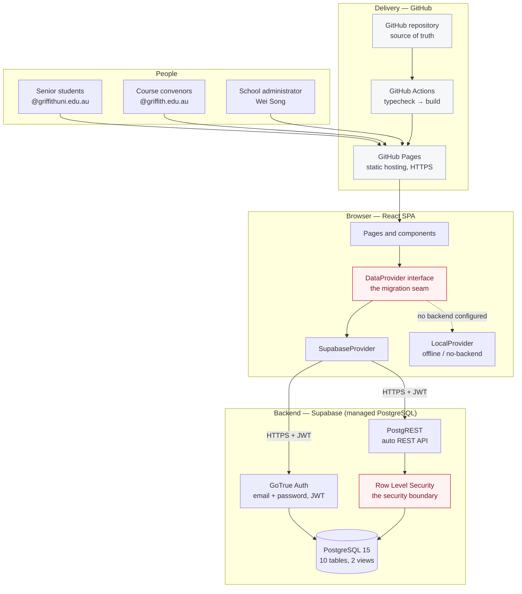
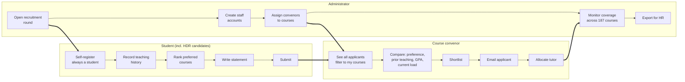
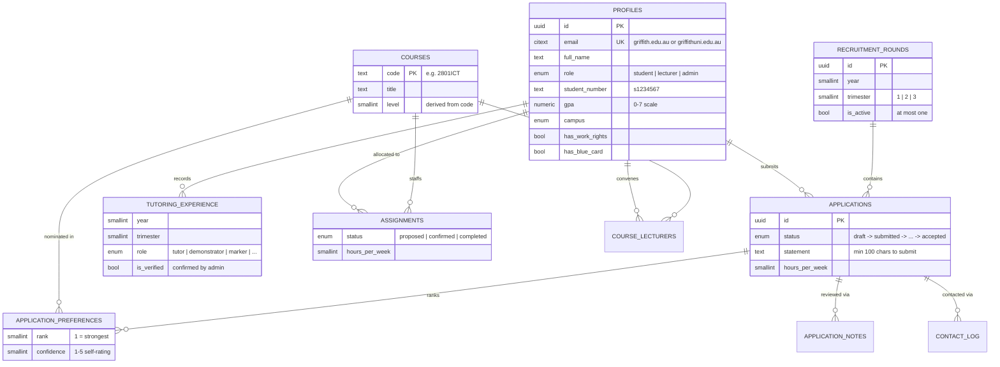
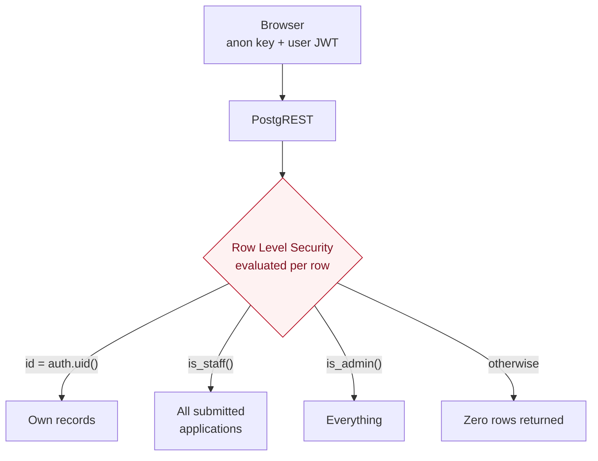
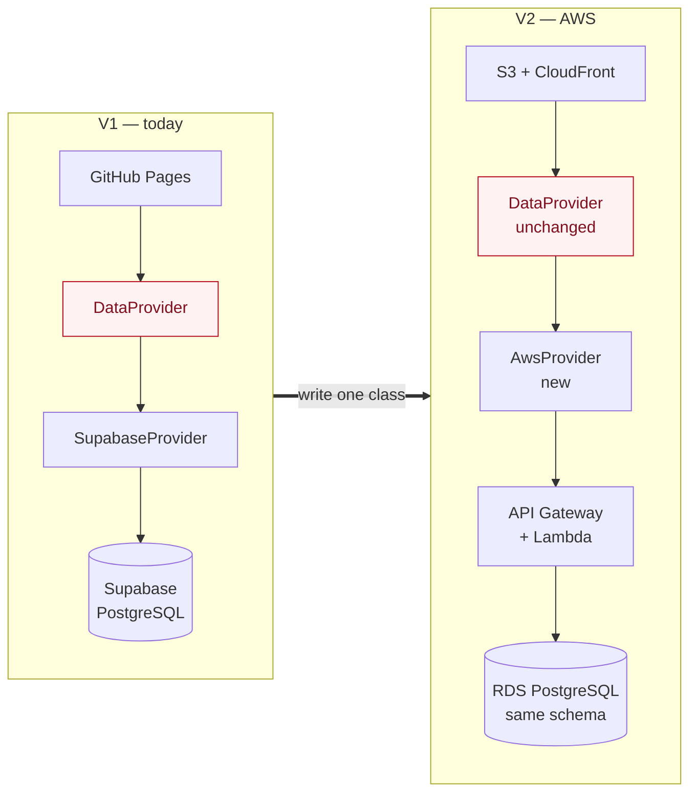

# System Architecture

**Casual Academic (Tutor) Management System**
School of Information and Communication Technology, Griffith University

---

## 1. What the system does

Each trimester the School of ICT recruits casual academics — tutors,
demonstrators and markers — across roughly 187 courses. Today that happens
through spreadsheets, individual emails and convenor memory. This system
replaces that with a single record of who applied, for what, who has taught it
before, and who was selected.

**In scope:** advertising a recruitment round, student application, convenor
review and selection, tutor allocation, School-wide reporting.

**Deliberately out of scope:** employment contracts, pay rates, timesheets and
onboarding. These are governed by the Academic Staff Enterprise Agreement and
administered by Griffith HR. The system records that an offer was accepted and
stops there. This keeps V1 free of any HR system integration.

---

## 2. High-level architecture

**Why this shape.** GitHub Pages serves only static files — it cannot run a
database or check a password. So the application is a static bundle, and all
state and authorisation live in a managed PostgreSQL backend that the browser
talks to directly over HTTPS. No server of our own to operate.

---

## 3. The three roles

| | Student | Convenor | Administrator |
|---|---|---|---|
| Own application | read / write | — | read |
| Other applications | — | all submitted (drafts excluded) | all |
| Applicant contact details | own | all applicants | all |
| Review notes | **never** | all | all |
| Allocate tutors | — | any course, recorded against them | all |
| Manage accounts & rounds | — | — | yes |

Staff access is School-wide by decision of the School: no reliable
convenor-to-course map exists, and requiring one would have prevented the
system being used at all. Course selection remains, as a personal filter.

What is still enforced in the database, not the interface: students see only
their own records, drafts are never visible to staff, review notes are never
visible to applicants, and only administrators manage accounts, courses and
rounds. Every view and contact is attributable via `contact_log` and
`audit_log`.

---

## 4. Data model

Ten tables plus an append-only `audit_log`. Two views (`applicant_rows`,
`course_demand`) do the joins the review screens need.

### Design decisions worth defending

| Decision | Reason |
|---|---|
| Self-registration cannot grant staff access | HDR candidates hold `@griffith.edu.au` addresses, so the domain identifies nobody. Staff accounts are provisioned by an administrator instead. |
| Course code is the primary key, not a surrogate id | `2801ICT` is already a stable, universally understood identifier at Griffith. A synthetic id would add joins and confuse exports. |
| Ranked preferences in a child table, not an array | Lets a convenor query "who put *my* course first" directly, and enforces distinct ranks with a unique constraint. |
| Experience separate from applications | A tutor's teaching record persists across trimesters; it is a property of the person, not of one application. |
| `assignments` separate from `applications` | An accepted application is a decision; an allocation is an operational fact with hours and a trimester. Conflating them makes multi-course tutors unrepresentable. |
| Trimester as `smallint` with a check constraint, not free text | Griffith runs T1/T2/T3. Constraining it prevents "Semester 1" appearing in the data three years from now. |
| `contact_log` exists at all | Contact happens over email, outside the system. Without a log, two convenors can chase the same candidate unknowingly. |

---

## 5. Security model

The browser holds only the Supabase **anon key**, which grants nothing by
itself. Every read and write is evaluated by PostgreSQL against the caller's
authenticated identity using Row Level Security policies.

**The important property:** because authorisation lives in the database rather
than the client, modifying the JavaScript in a browser gains an attacker
nothing. A student who edits the frontend to request all applications still
receives only their own rows.

Specific controls:

- **Registration is restricted to Griffith domains** by a `CHECK` constraint on
  `profiles.email` *and* by the `handle_new_user()` trigger — not merely by
  form validation.
- **Self-registration always creates a student**, whichever Griffith domain is
  used. The role is never read from `raw_user_meta_data`, which the client
  controls at signup — trusting it would let anyone register as a lecturer.
  Promotion to `lecturer` or `admin` happens only through an administrator,
  after the account exists.
- **Users cannot escalate their own privileges.** A trigger blocks any
  self-update that changes `role`, `is_active` or `email`.
- **Drafts are invisible to staff.** `can_view_application()` excludes
  `status = 'draft'`.
- **Review notes are never visible to applicants** — staff-only policies.
- **Submission rules are server-side** (`submit_application()`): round still
  open, at least one course, statement of 100+ characters.
- **Convenors can only allocate to their own courses** — `teaches_course()`.
- **The service-role key never reaches the browser.** It is used only by
  `scripts/bootstrap.ts`, run locally.

### Privacy note for the School

The published Pages site is publicly reachable, but contains **no personal
data** — only application code. All student information sits behind
authentication in the database. The site is marked `noindex, nofollow`. If a
stricter posture is required (URL not publicly reachable at all), that is the
trigger to bring forward the AWS migration described below, where the
application can sit behind the Griffith network or an identity-aware proxy.

---

## 6. Migration path to AWS

The system was structured so this is a contained piece of work rather than a
rewrite. Everything the UI does goes through one interface, `DataProvider`
(`src/lib/provider/types.ts`). No component imports Supabase directly.

| Concern | V1 (Supabase) | V2 (AWS) | Effort |
|---|---|---|---|
| Database | Supabase PostgreSQL | RDS / Aurora PostgreSQL | `pg_dump` → `pg_restore`. Schema is standard PostgreSQL. |
| Authentication | GoTrue | Amazon Cognito | Replace `auth.uid()` with a session variable set per request. |
| API | PostgREST | API Gateway + Lambda | New; the SQL it runs is already written. |
| Authorisation | RLS policies | **Same RLS policies** | Unchanged — they are plain PostgreSQL. |
| Static hosting | GitHub Pages | S3 + CloudFront | Change one build target. |
| Frontend code | — | — | One new provider class; zero component changes. |
| Routing | `HashRouter` | `BrowserRouter` | One line, once CloudFront can rewrite 404 → index.html. |

The only Supabase-specific SQL is the `auth.uid()` / `auth.users` references,
isolated to `0002_functions.sql` and `0003_rls.sql`.

---

## 7. Technology choices

| Layer | Choice | Why |
|---|---|---|
| UI | React 18 + TypeScript | Standard, well-understood, hires easily. TypeScript catches contract drift between UI and data model at compile time. |
| Build | Vite | Fast, first-class static output for Pages. |
| Styling | Tailwind CSS | Consistent spacing and colour without a bespoke design system to maintain. |
| Routing | React Router (hash mode) | Hash routing avoids the deep-link 404 problem inherent to static hosting. |
| Backend | Supabase | Managed PostgreSQL with auth and RLS. Chosen specifically because it is *stock* PostgreSQL, keeping the AWS path open. |
| Hosting | GitHub Pages via Actions | Free, HTTPS, deploys on push, no infrastructure to run. |

---

## 8. Current limitations

Stated plainly, because a prototype that oversells itself is worse than one
that does not.

1. **No file uploads.** CVs are linked, not stored, avoiding storage-policy
   questions in V1.
2. **No Griffith single sign-on.** Registration is by Griffith email with a
   separate password. SSO requires Griffith IT to register the application as
   an identity provider client.
3. **Course catalogue is a point-in-time snapshot** (September 2026, 187
   courses). No live feed from the Griffith course system exists to consume.
4. **Convenor assignment is manual.** An administrator assigns courses to
   convenors; there is no automatic feed from the timetabling system.
5. **GPA is self-reported.** There is no student-records integration to verify
   it, so convenors should treat it as indicative.

Items 2, 3 and 4 all become straightforward once the School has an
integration agreement with Griffith IT — which is a reasonable thing to seek
on the strength of a working prototype.

### Not a limitation: contact happens over email

Convenors contact applicants from their own mail address, outside the system.
This is deliberate, not a gap. A message from a convenor carries more weight
than an automated notification, both parties already work in email, and no
Griffith-approved sending domain is required. The system's job is to make that
contact easy and traceable: it supplies the applicant's details, opens the
convenor's mail client with the message already written, and records that
contact took place so a second convenor does not approach the same candidate
unknowingly.
