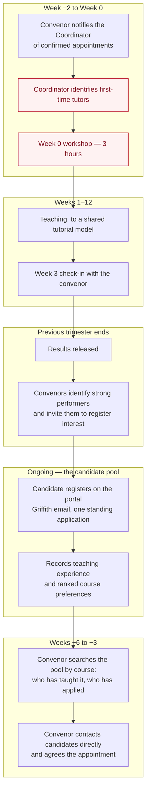

# 2. The trimester cycle

*From results release to the classroom, with a named owner at every step.*

---

## Overview

---

## Step 1 — Invite, at results release

**Owner: course convenor. Timing: within two weeks of results release.**

When results are released, the convenor identifies students who did well in the
course — as a guide, a **6 or 7** (Distinction or High Distinction) — and emails
them an invitation to register interest in tutoring it.

This is the step that changes the character of recruitment. At present, students
find out about tutoring by knowing somebody. A short email, sent to the people
who just demonstrated they understand the material, reaches students who would
never have thought to ask — which is both a wider and a fairer pool.

A template is provided in [Appendix A](#appendix-a--invitation-template). The
convenor does not need to promise anything: the invitation is to join the pool.

> **On the grade threshold.** A 6 is a guide, not a gate. Someone who improved
> markedly, or who has taught elsewhere, may be a better tutor than someone who
> scored a 7 in silence. The portal records teaching experience precisely so
> that judgement stays with the convenor.

---

## Step 2 — Register and apply

**Owner: the candidate. Timing: any time.**

The candidate registers at the portal with their Griffith email and completes
one standing application:

- Contact details, program, campus
- **Teaching experience** — course, trimester, role, what they did. Griffith or
  elsewhere.
- **Applied courses** — up to six, ranked
- A supporting statement
- Availability and right-to-work declarations

Applications are open permanently. There is no round to wait for, and the form
can be resubmitted whenever the candidate's experience changes.

---

## Step 3 — Select

**Owner: course convenor. Timing: six to three weeks before teaching starts.**

The convenor opens the portal and filters by their course. They see everyone
connected to it — those who have taught it before, and those who have applied
for it — with the experienced sorted first.

They contact candidates directly by email and agree the appointment. **The
conversation happens over email, not in the system**: a message from the
convenor carries more weight than an automated notification, and the decision
is theirs.

---

## Step 4 — Confirm and identify first-time tutors

**Owner: convenor, then the Coordinator. Timing: two weeks before Week 0.**

The convenor tells the Coordinator who they have appointed. The Coordinator
checks each name against the portal record and against previous trimesters, and
produces two lists:

- **First-time tutors** — attendance at the Week 0 workshop is required
- **Returning tutors** — attendance is optional and welcome

Because the portal holds each person's teaching history, this list is derived
rather than compiled by asking around.

---

## Step 5 — Week 0 workshop

**Owner: Coordinator. Timing: Week 0, before teaching starts.**

Three hours, in a computer lab. Design and run sheet in
[3. Week 0 workshop](03-workshop.md).

Attendance is recorded. A tutor who cannot attend the session attends the next
one and is paired with an experienced tutor in the interim — the requirement is
not waived, it is deferred.

---

## Step 6 — Teach, with a check-in

**Owner: course convenor. Timing: Week 3.**

A short conversation between convenor and each first-time tutor in Week 3: what
is working, what is not, one thing to try. Fifteen minutes.

Week 3 is chosen deliberately. It is late enough that real problems have
surfaced and early enough that the trimester can still be rescued.

---

## Step 7 — Close out

**Owner: convenor. Timing: end of trimester.**

The convenor confirms the engagement is complete. The tutor's record — course,
trimester, role — carries forward in the portal, so next trimester's convenors
can see that this person has taught this course, without having to know them.

Then Step 1 begins again with the new results.

---

## Roles

| Role | Responsibility |
|---|---|
| **Casual Academic Coordinator** | Owns the cycle. Runs the workshop, maintains the materials, keeps the attendance record, reports to the Head of School. |
| **Course convenor** | Invites strong students, selects tutors, notifies the Coordinator, runs the Week 3 check-in, closes out. |
| **Candidate / tutor** | Keeps their portal record current. Attends the workshop if new. Teaches to the shared model. |
| **Head of School** | Endorses the cycle and the attendance expectation, receives the end-of-trimester report. |
| **School Manager** | Employment paperwork and payroll, unchanged — this proposal does not touch it. |

---

## What this deliberately does not do

**It does not replace Griffith HR.** Contracts, pay rates and onboarding remain
with the University under the Academic Staff Enterprise Agreement. The portal
records that an appointment was agreed; everything downstream is unchanged.

**It does not centralise hiring.** Convenors choose their own tutors. The
proposal makes candidates findable and prepares those chosen; it does not take
the decision away from the person who has to teach the course.

**It does not assess tutors.** The Week 3 check-in is developmental, not a
performance review. Performance management is a matter for the convenor and the
School Manager through the ordinary process.

---

## Appendix A — Invitation template

> **Subject:** Interested in tutoring 2801ICT next trimester?
>
> Dear [name],
>
> You did well in 2801ICT this trimester, and I am writing to ask whether you
> would consider tutoring it.
>
> Tutoring is paid casual academic work: you would run tutorials or labs,
> support students through the practical tasks, and mark. It is good experience
> for anyone considering research or teaching, and students consistently tell us
> the tutors who most recently took the course are the ones who explain it best.
>
> If you are interested, register your interest at:
> [portal link]
>
> Registering does not commit you to anything. It puts you in front of the
> convenors staffing courses next trimester, including me.
>
> The School runs a three-hour training workshop in Week 0 for anyone tutoring
> for the first time, so no previous teaching experience is expected.
>
> [Convenor name]
> Course Convenor, 2801ICT
